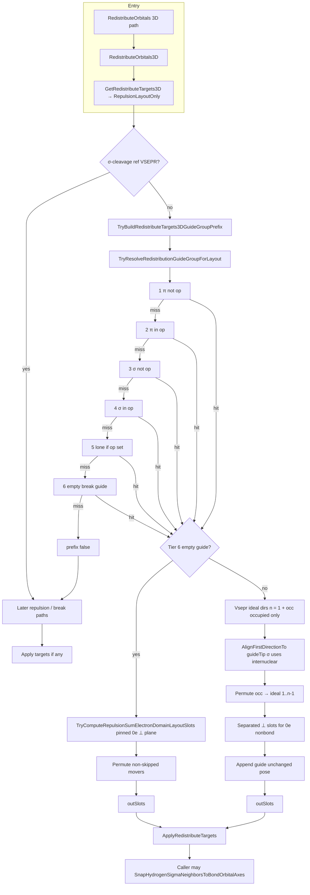

# Electron redistribution (3D repulsion layout): guide group

This note describes the **current** behavior for **3D full orbital geometry** (`OrbitalAngleUtility.UseFull3DOrbitalGeometry`): the **repulsion-only** target path and its **guide-group** prefix. Legacy 2D `RedistributeOrbitals` (angle collection / π-origin) is not covered here.

**Primary code:** `Assets/Scripts/AtomFunction.cs` — `RedistributeOrbitals` → `RedistributeOrbitals3D` → `GetRedistributeTargets3D` → `GetRedistributeTargets3DRepulsionLayoutOnly` → optional `TryBuildRedistributeTargets3DGuideGroupPrefix`.

---

## End-to-end flow (high level)

1. **Call site** (e.g. `EditModeManager.FormSigmaBondInstant`) passes **`redistributionOperationBond`**: the `CovalentBond` being formed (or broken) in that pass.
2. **`RedistributeOrbitals(..., redistributionOperationBond: bond)`** runs **`RedistributeOrbitals3D`**, which calls **`GetRedistributeTargets3D`**. When **`AtomFunction.UseRepulsionLayoutOnlyInGetRedistributeTargets3D`** is true (default), targets come from **`GetRedistributeTargets3DRepulsionLayoutOnly`**.
3. **Guide-group prefix** runs first **unless** the atom is in **σ-cleavage ref VSEPR framing** (`useSigmaCleavageRefForVsepr`: break refs + full σ cleavage between former partners). If the prefix succeeds, its slot list is returned and **no later repulsion branch** in that method runs for that atom.
4. **`ApplyRedistributeTargets(targets)`** applies each **`(orbital, localPosition, localRotation)`**. Bond formation may then run **`SnapHydrogenSigmaNeighborsToBondOrbitalAxes`** so H nuclei follow σ lobes (after `RedistributeOrbitals` returns).

---

## Guide resolution: `TryResolveRedistributionGuideGroupForLayout`

Single **guide** orbital (and optional **`guideBond`**) is chosen by **strict priority** — **first matching tier wins** (tiers below are **`RedistributionGuideSource`**).

| Tier | Name | Rule (simplified) |
|------|------|-------------------|
| 1 | `PiBondNotInOperation` | First π-line `CovalentBond` on this atom with `b != redistributionOperationBond` (by `GetInstanceID()`). |
| 2 | `PiBondInOperation` | `redistributionOperationBond` is π-line on this atom and has `Orbital`. |
| 3 | `SigmaBondNotInOperation` | First σ-line bond on this atom with `b != redistributionOperationBond`. |
| 4 | `SigmaBondInOperation` | `redistributionOperationBond` is σ-line on this atom and has `Orbital`. |
| 5 | `LonePairFromOperation` | `redistributionOperationBond != null` and first occupied nonbond lobe on nucleus (`bondedOrbitals`, `Bond == null`, `ElectronCount > 0`). |
| 6 | `EmptyOrbitalFromOperation` | Passed **`bondBreakGuideLoneOrbitalForTargets`**: 0e, bonding cleared (`IsBondBreakGuideOrbitalWithBondingCleared`). |

**Note:** With **two** σ bonds (e.g. second H on carbon), tier **3** always succeeds before tier **4**, so the guide is typically an **older** C–H σ, not the new operation σ.

---

## Building targets: `TryBuildRedistributeTargets3DGuideGroupPrefix`

### Branch A — tier 6 (`EmptyOrbitalFromOperation`)

- Domains: **`GetCarbonSigmaCleavageDomains`** (σ lobes + all nonbond on nucleus).
- **Occupied** + **empty** nonbond lists feed **`TryComputeRepulsionSumElectronDomainLayoutSlots`**: repulsion in the plane **⊥** the **pinned 0e guide** (perpendicular-to-guide chemistry for σ-cleavage style frames).
- **`FindBestOrbitalToTargetDirsPermutation`** on **non-skipped** slots; guide lobe may stay pinned (`skipApply`).

### Branch B — tiers 1–5 (bonding or occupied lone guide)

1. **Movers:** `CollectRedistributionGuideGroupMoversExcludingGuide` — every other **`CovalentBond.Orbital`** on this atom plus every **`bondedOrbitals`** entry except the guide.
2. Split movers into **`occ`** (occupied: σ/π on bond or occupied nonbond via **`IsRepulsionOccupiedDomainForGuideGroupLayout`**) and **`emp`** (0e nonbond via **`IsRepulsionEmptyNonBondMoverForGuideGroup`**).
3. **Merge occupied nonbond:** any lobe in **`GetCarbonSigmaCleavageDomains` → `nonBondOnNucleus`** with **`ElectronCount > 0`** is forced into **`occ`** so lone lobes are not missed.
4. **Electron geometry count:** **`nVseprGroups = 1 + occ.Count`** — **only occupied** movers count as VSEPR vertices; **0e nonbond orbitals are not** ideal-slot vertices.
5. **Frame alignment:** `VseprLayout.GetIdealLocalDirections(nVseprGroups)` then **`VseprLayout.AlignFirstDirectionTo(..., guideTip)`**.
   - For a **σ guide** with **`guideBond`**, **`guideTip`** is the **internuclear** axis to the σ partner (nucleus-local), so vertex 0 matches **C→neighbor** used in diagnostics and post-snap H alignment; π / lone guides fall back to **orbital tip**.
6. **Permutation:** **`FindBestOrbitalToTargetDirsPermutation(occ, alignedIdeal[1..], ...)`** — directions are **fixed** before matching; the permute step only assigns **which** occupied orbital sits on **which** remaining vertex.
7. **0e movers:** **`TryComputeSeparatedEmptySlot`** against a framework built from **`guideTip`** + **`alignedIdeal[1..]`**, with multiple empties separated via accumulated tips.
8. **Guide row:** guide is appended with **current** local pose (not re-canonicalized to vertex 0 in this list); movers get **`GetCanonicalSlotPositionFromLocalDirection`**.

**Output order:** occupied mover slots → empty mover slots → guide slot.

---

## Repulsion-only chain after guide group

If the prefix fails or is skipped, `GetRedistributeTargets3DRepulsionLayoutOnly` continues with σ-cleavage shell, σN=0 four-non-bond, **`TryComputeRepulsionSumElectronDomainLayoutSlots`** on electron domains, nonbond-only repulsion, etc. (see XML summary on that method).

---

## Flow chart

---

## Related flags / logs

- **`CovalentBond.DebugLogBondBreakTetraFramework`**: `[break-tetra] GetRedistributeTargets3D ...` lines (guide source, `nVseprGroups`, `occMovers`, `empSlots`, ids).
- **`redistributionOperationBond`**: threaded from bond formation/break callers into `RedistributeOrbitals` / `GetRedistributeTargets3D` so tiers can exclude or prefer the “op” bond.

---

## Files (reference)

| Piece | Location |
|-------|----------|
| Resolver + enum | `AtomFunction.TryResolveRedistributionGuideGroupForLayout`, `RedistributionGuideSource` |
| Prefix builder | `AtomFunction.TryBuildRedistributeTargets3DGuideGroupPrefix` |
| Repulsion-only list | `AtomFunction.GetRedistributeTargets3DRepulsionLayoutOnly` |
| 3D apply + diag | `AtomFunction.RedistributeOrbitals3D`, `ApplyRedistributeTargets` |
| Ideal geometry | `VseprLayout.GetIdealLocalDirections`, `AlignFirstDirectionTo` |
| Domain inventory | `AtomFunction.GetCarbonSigmaCleavageDomains` |
